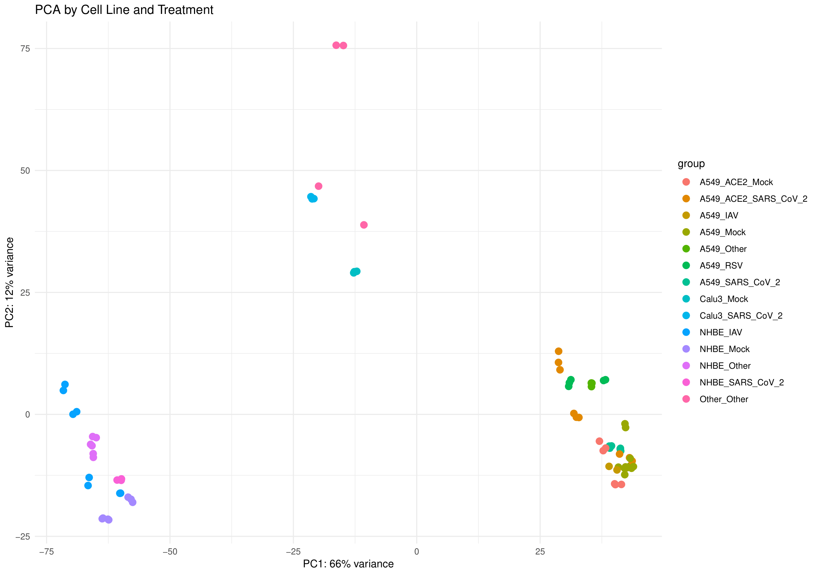
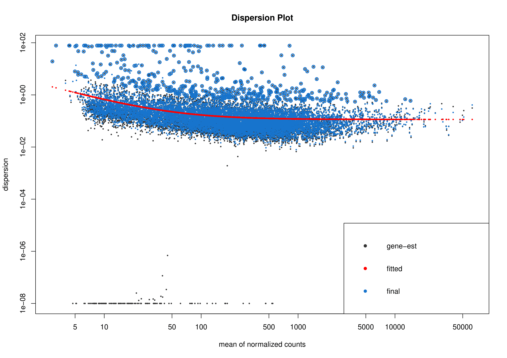
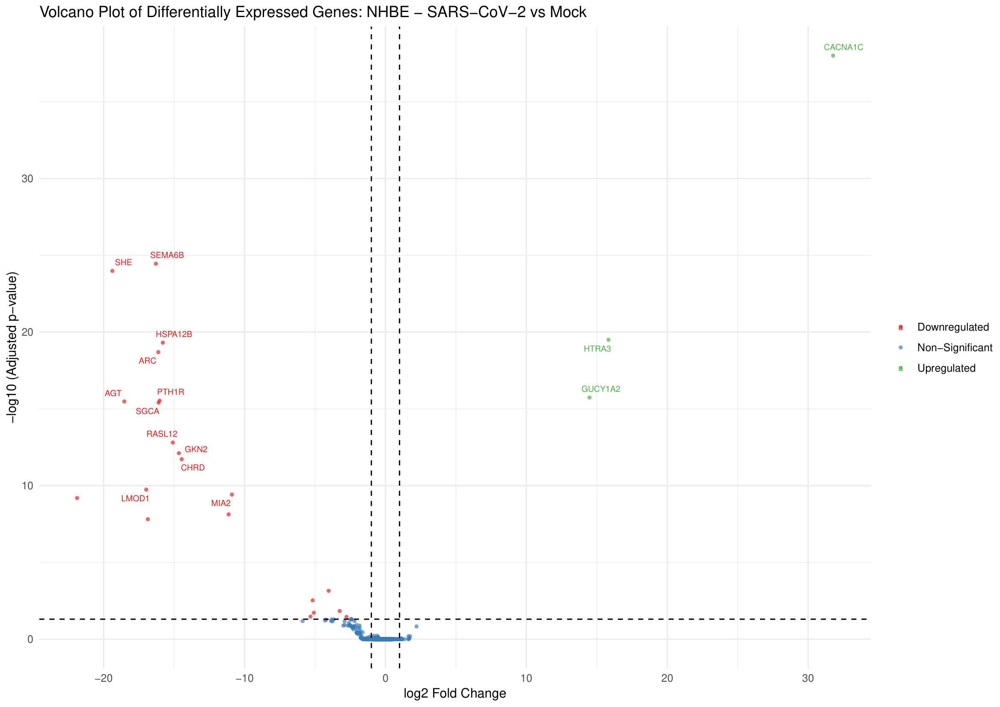
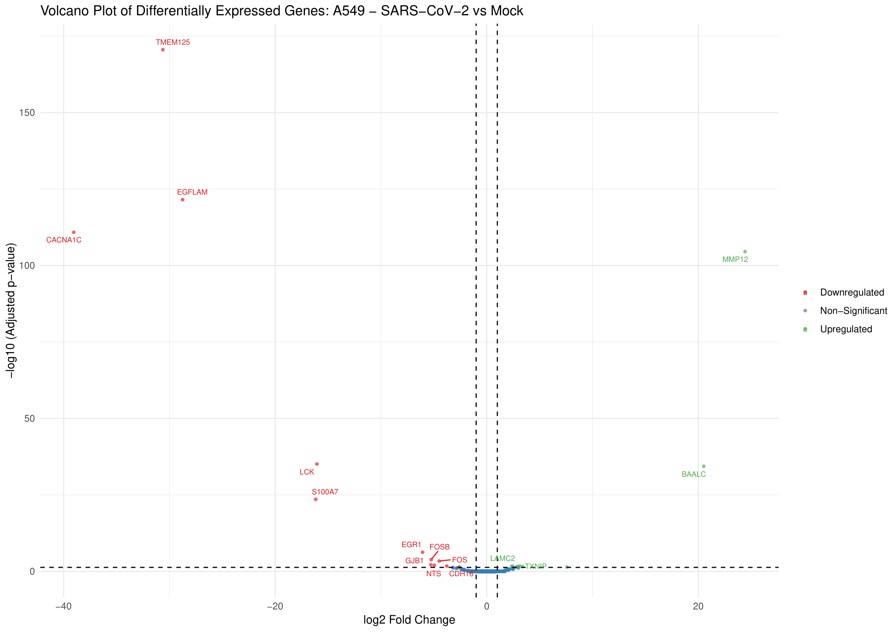
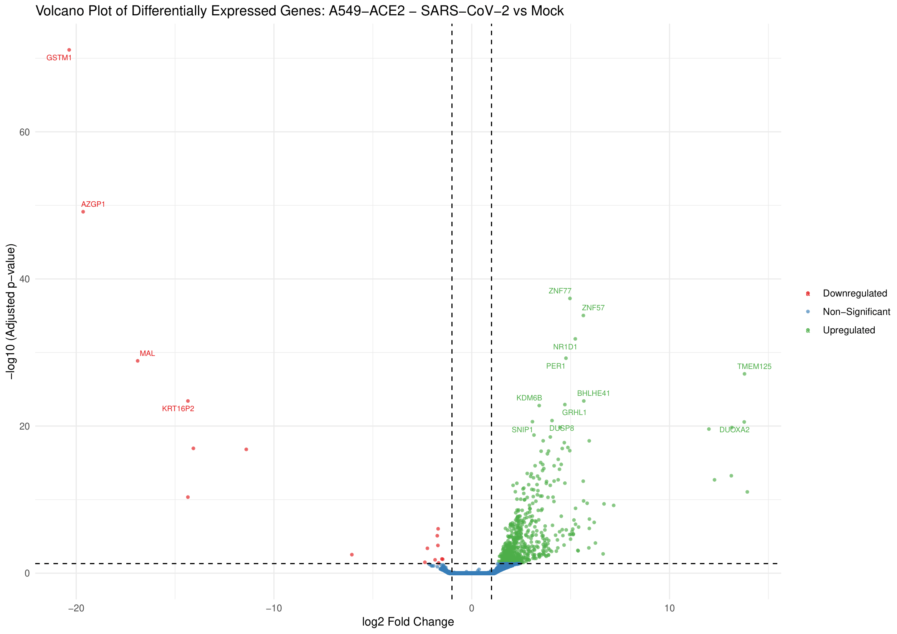
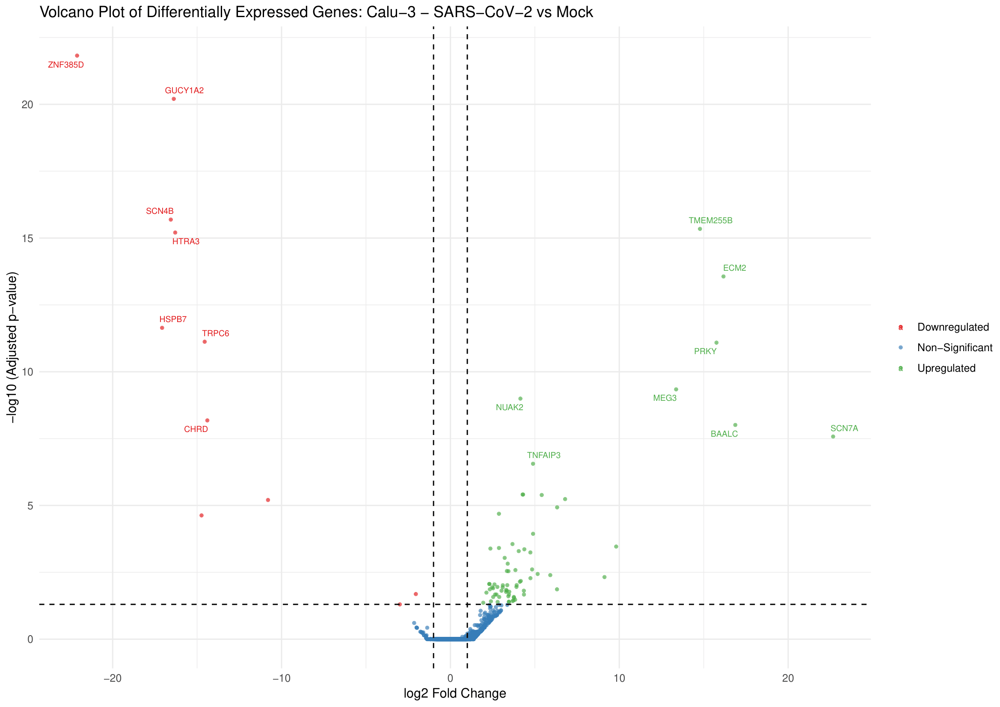
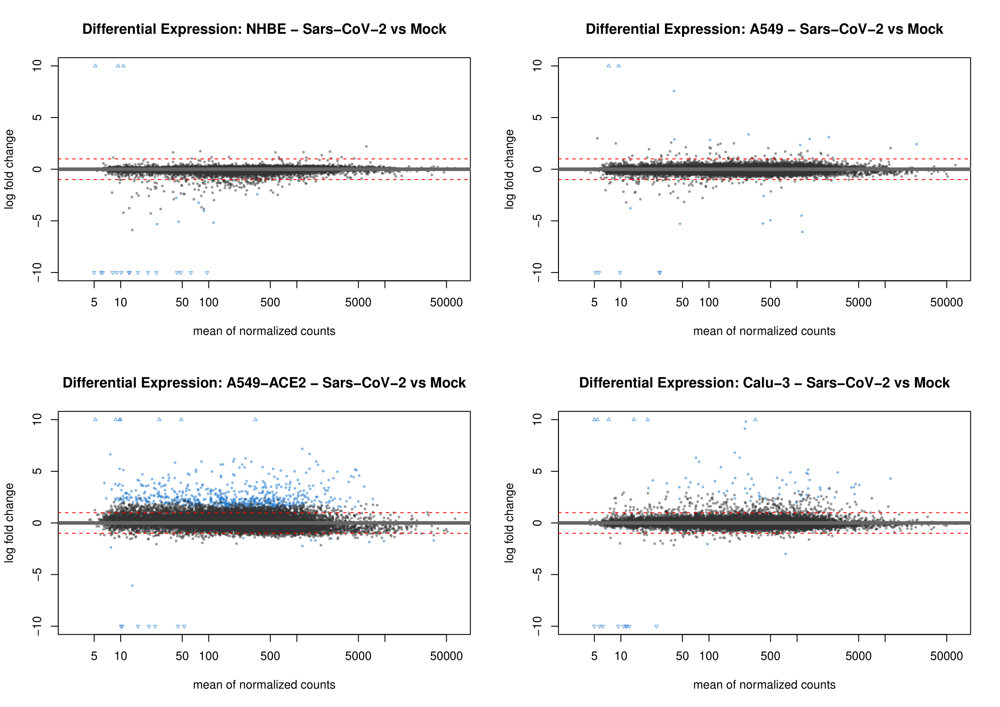

# SARS-CoV-2 RNA-Seq Differential Gene Expression (DGE) Analysis Across Multiple Cell-lines
This repository contains an end-to-end RNA-Seq DGE Analysis pipeline built in RStudio to analyze host transcriptional responses to SARS-CoV-2 across four respiratory cell lines — NHBE, A549, A549-ACE2, and Calu3, with DESeq2 and fold-change shrinkage. Using raw read counts from the [GSE147507](https://www.ncbi.nlm.nih.gov/geo/query/acc.cgi?acc=GSE147507) benchmark study, this pipeline handles complex multi-condition experimental matrices and implements rigorous quality-control protocols.

---

## Key Technical Implementations
- **DESeq2 with ashr fold-change shrinkage —**  DESeq2 was chosen to generate the results because it is specifically built for RNA-seq count data, accounting for the natural variability that comes with measuring gene expression across biological replicates. An additional shrinkage step (ashr) was applied to correct fold-change estimates for low-expressed genes, which tend to produce unreliably large numbers, making the final list of significant genes more trustworthy.
- **Variance Stabilising Transformation (VST) for quality control —** Raw RNA-seq counts are inherently noisy and difficult to compare directly, especially between low- and high-expressed genes. VST was applied to produce a stabilised version of the data used purely for visualisation. The scatter plots confirmed that it effectively compressed the wide dynamic range of raw counts into a more comparable scale, and the histograms showed the expected shift from a heavily skewed distribution to a more even one.
- **A single unified model across all four cell lines —** Rather than running four completely separate analyses, one combined model was built incorporating all cell lines and treatments, with individual comparisons extracted from it. This allows the model to learn from the full dataset when estimating gene variability, which is particularly beneficial for conditions with fewer replicates.

## Key Biological Insights Derived
- The data passed quality checks cleanly before any differential testing. The sample-to-sample distance heatmaps showed that replicates within each cell line grouped tightly together, and the PCA plot revealed that cell line identity was the dominant driver of variation, with treatment effects visible as a secondary layer of separation within each group. The dispersion plot followed the expected pattern for a well-fitted DESeq2 model, with gene-level estimates converging neatly toward the fitted trend, together confirming the dataset was clean and the model reliable.

### PCA Plot & Dispersion Plot
<table>
  <td></td>
  <td></td>
</table>

- SARS-CoV-2 provoked a dramatically different response depending on the cell line, which was visually striking across the volcano and MA plots. NHBE and A549 plots were relatively sparse, with few genes crossing the significance thresholds, while A549-ACE2 and Calu3 were densely populated with significant hits, particularly on the upregulated side. In numbers, A549-ACE2 yielded 658 significant genes compared to just 22 in the ACE2-low A549 parent line, directly reflecting how much the presence of the ACE2 receptor amplifies the host cell's response to infection.

### Volcano Plots — SARS-CoV-2 vs Mock across Cell Lines
<table>
  <tr>
    <td></td>
    <td></td>
  </tr>
  <tr>
    <td></td>
    <td></td>
  </tr>
</table>

### MA Plots


- NHBE cells were largely silenced by infection, while A549-ACE2 and Calu3 were strongly activated. The gene heatmaps made this directional contrast visually clear. In NHBE, the top hits showed consistent suppression across infected replicates relative to mock, whereas A549-ACE2 and Calu3 heatmaps were dominated by genes switching on strongly upon infection. This pattern, where primary airway cells go quiet while other models mount a large response, aligns with the idea that SARS-CoV-2 is particularly effective at dampening the immune response in the cells it most naturally infects.

---

## Repository Structure

```
SARS-CoV-2_RNA-Seq_Differential-Gene-Expression_Analysis/
├── GSE147507_DGE_Analysis/
│   ├── code/
│   │   └── DGE_Analysis.R                            
│   ├── datasets/
|   |   |── GSE147507-GPL18573_series_matrix.txt
|   |   |── GSE147507_RawReadCounts_Human.tsv                  
│   ├── results/
│   │   ├── significant_DGE_across_A549-ACE2.csv 
│   │   ├── significant_DGE_across_A549.csv
│   │   ├── significant_DGE_across_Calu-3.csv
│   │   └── significant_DGE_across_NHBE.csv 
│   └── visualizations/
│       ├── 01_Scatter_Plots.png
│       ├── 02_Histograms.png
│       ├── 03_Sample_Distance_Heatmap_NHBE.png
│       ├── 04_Sample_Distance_Heatmap_A549.png
│       ├── 05_Sample_Distance_Heatmap_A549_ACE2.png
│       ├── 06_Sample_Distance_Heatmap_Calu3.png
│       ├── 07_PCA_Plot.png
│       ├── 08_Dispersion_Plot.png
│       ├── 09_MA_Plots.png
│       ├── 10_Volcano_Plot_NHBE.png
│       ├── 11_Volcano_Plot_A549.png
│       ├── 12_Volcano_Plot_A549_ACE2.png
│       ├── 13_Volcano_Plot_Calu3.png
│       ├── 14_Top_10_Upregulated_Genes_Heatmap_NHBE.png
│       ├── 15_Top_10_Upregulated_Genes_Heatmap_A549.png
│       ├── 16_Top_10_Upregulated_Genes_Heatmap_A549_ACE2.png
│       ├── 17_Top_10_Upregulated_Genes_Heatmap_Calu3.png
│       ├── 18_Top_10_Downregulated_Genes_Heatmap_NHBE.png
│       ├── 19_Top_10_Downregulated_Genes_Heatmap_A549.png
│       ├── 20_Top_10_Downregulated_Genes_Heatmap_A549_ACE2.png
│       └── 21_Top_10_Downregulated_Genes_Heatmap_Calu3.png
├── LICENSE
└── README.md
```

---

## Data Acquisition

Both raw dataset files are included in the `GSE147507_DGE_Analysis/datasets/` folder.
The original data is publicly available from NCBI GEO under accession [GSE147507](https://www.ncbi.nlm.nih.gov/geo/query/acc.cgi?acc=GSE147507).

---

## Dependencies

All analyses were performed in **RStudio** using R 4.6.0 (2026-04-24 ucrt), Bioconductor version 3.23 (BiocManager 1.30.27). Install the required packages before running the script:

```
if (!require("BiocManager", quietly = TRUE)) install.packages("BiocManager")
if (!requireNamespace("Biobase", quietly = TRUE)) BiocManager::install("Biobase")
if (!requireNamespace("GEOquery", quietly = TRUE)) BiocManager::install("GEOquery")
if (!requireNamespace("DESeq2", quietly = TRUE)) BiocManager::install("DESeq2")
if (!requireNamespace("ashr", quietly = TRUE)) BiocManager::install("ashr")
if (!requireNamespace("pheatmap", quietly = TRUE)) BiocManager::install("pheatmap")
if (!requireNamespace("ggrepel", quietly = TRUE)) BiocManager::install("ggrepel")
if (!requireNamespace("readr", quietly = TRUE)) install.packages("readr")
if (!requireNamespace("here", quietly = TRUE)) install.packages("here")
```

---

## How to Reproduce

1. Clone this repository: https://github.com/ghoshparnabali/SARS-CoV-2_RNA-Seq_Differential-Gene-Expression_Analysis
2. Open `GSE147507_DGE_Analysis/code/DGE Analysis.R` in RStudio.
3. Install all required packages (see Dependencies above).
4. Run the script. DGE result CSV files will be saved to a `results/` folder in the working directory. All visualisations will be rendered in RStudio's plot pane and can be exported manually from there.

---

## License

This project is licensed under the MIT License — see the [LICENSE](https://github.com/ghoshparnabali/SARS-CoV-2_RNA-Seq_Differential-Gene-Expression_Analysis/blob/main/LICENSE) file for details.
