# SARS-CoV-2 RNA-Seq Differential Gene Expression (DGE) Analysis Across Multiple Cell-lines
This repository contains an end-to-end RNA-Seq DGE Analysis pipeline built in RStudio to analyze host transcriptional responses to SARS-CoV-2 across four respiratory cell lines — NHBE, A549, A549-ACE2, and Calu-3 — with DESeq2, fold-change shrinkage, and functional enrichment analysis. Using raw read counts from the [GSE147507](https://www.ncbi.nlm.nih.gov/geo/query/acc.cgi?acc=GSE147507) benchmark study, this pipeline handles complex multi-condition experimental matrices and implements rigorous quality-control protocols.

---

## Key Technical Implementations
- **DESeq2 with ashr fold-change shrinkage —**  DESeq2 was chosen because it is specifically built for RNA-seq count data, modelling each gene's variability using a negative binomial distribution with empirical Bayes shrinkage of dispersion estimates across genes. Fold-change shrinkage via ashr was applied over the alternative apeglm because ashr uses an adaptive shrinkage framework that does not assume a fixed prior shape, making it more conservative and reliable for lowly-expressed genes with unstable fold-change estimates, which are common in datasets with small per-group replicate counts like GSE147507.
- **Variance Stabilising Transformation (VST) for quality control —**  Raw RNA-seq counts are inherently heteroscedastic — their variance scales with the mean, making low- and high-expressed genes difficult to compare directly. VST was applied to produce a homoscedastic, stabilised representation used exclusively for quality-control visualisations. The scatter plots confirmed effective dynamic range compression, and the histogram shift from a heavily right-skewed distribution to a near-uniform one validated the transformation. VST was not used for differential testing, where DESeq2's internal modelling of the raw count distribution is more appropriate.
- **Unified group-level design matrix across all four cell lines —** The model was specified with a single composite group factor encoding all cell-line–treatment combinations (e.g. NHBE_SARS_CoV_2, A549_Mock) rather than separate interaction terms for cell line and treatment. This design (~ group) allows individual pairwise contrasts to be extracted cleanly from a single fitted model while enabling DESeq2 to estimate gene dispersion using the full dataset — improving statistical power particularly for conditions with only two or three replicates, such as NHBE.
- **Functional enrichment analysis using clusterProfiler —** Gene Ontology (GO Biological Process and Molecular Function) and KEGG pathway enrichment analyses were performed on significant DEG lists using clusterProfiler, with Benjamini-Hochberg multiple testing correction. Enrichment was run separately for upregulated and downregulated gene sets per cell line to capture directional pathway activation. Cell lines with fewer than 5 significant genes in a given direction were excluded from enrichment to avoid statistical artefacts from small gene sets.

## Key Biological Insights Derived
- **Quality Control —** All four cell lines passed quality thresholds prior to differential testing. The sample-to-sample distance heatmaps confirmed that biological replicates within each cell line clustered tightly, and the PCA plot revealed that cell line identity was the dominant driver of transcriptional variation, with treatment effects visible as a secondary layer of separation within each group. The dispersion plot followed the expected convergence pattern for a well-fitted DESeq2 model, with gene-level dispersion estimates shrinking neatly toward the fitted mean-dispersion trend, together confirming the dataset was clean and the model reliable.

#### PCA Plot & Dispersion Plot
<table>
  <td>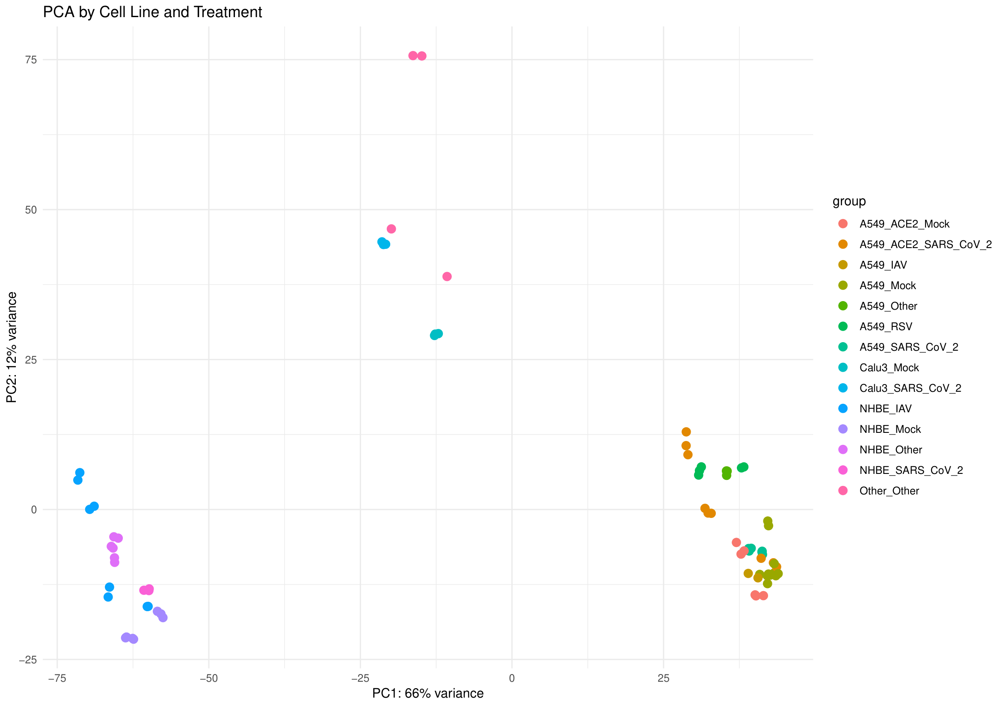</td>
  <td>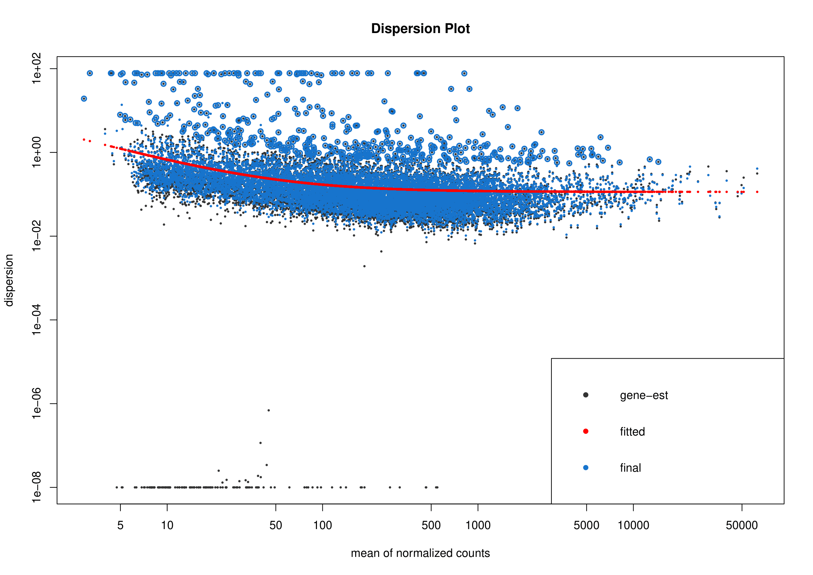</td>
</table>

- **Differential Expression —** SARS-CoV-2 provoked dramatically different transcriptional responses depending on the cell line, which was visually striking across the volcano and MA plots. NHBE and A549 plots were relatively sparse, with few genes crossing the significance thresholds, while A549-ACE2 and Calu3 were densely populated with significant hits, particularly on the upregulated side. In numbers, A549-ACE2 yielded 658 significant genes compared to just 22 in the ACE2-low A549 parent line, directly reflecting how much the presence of the ACE2 receptor amplifies the host cell's response to infection.

#### Volcano Plots — SARS-CoV-2 vs Mock across Cell Lines
<table>
  <tr>
    <td>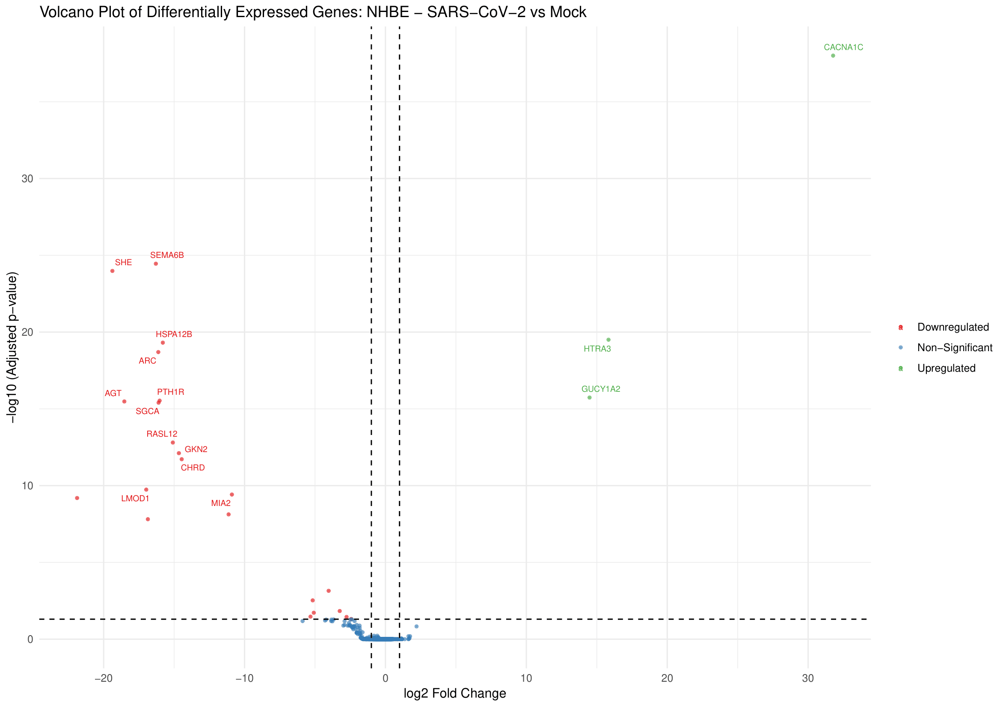</td>
    <td>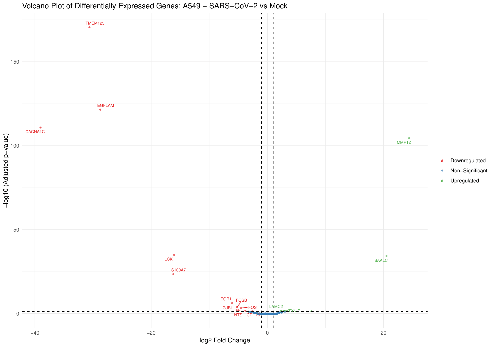</td>
  </tr>
  <tr>
    <td>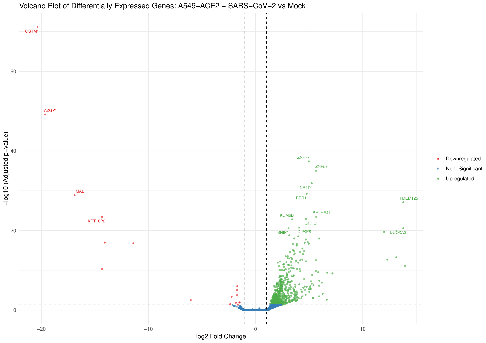</td>
    <td>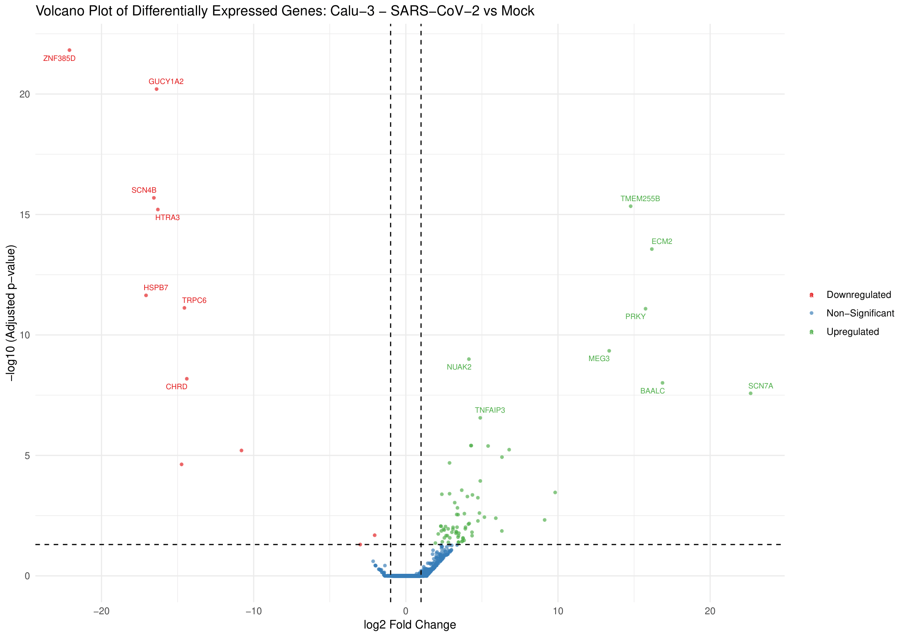</td>
  </tr>
</table>

#### MA Plots
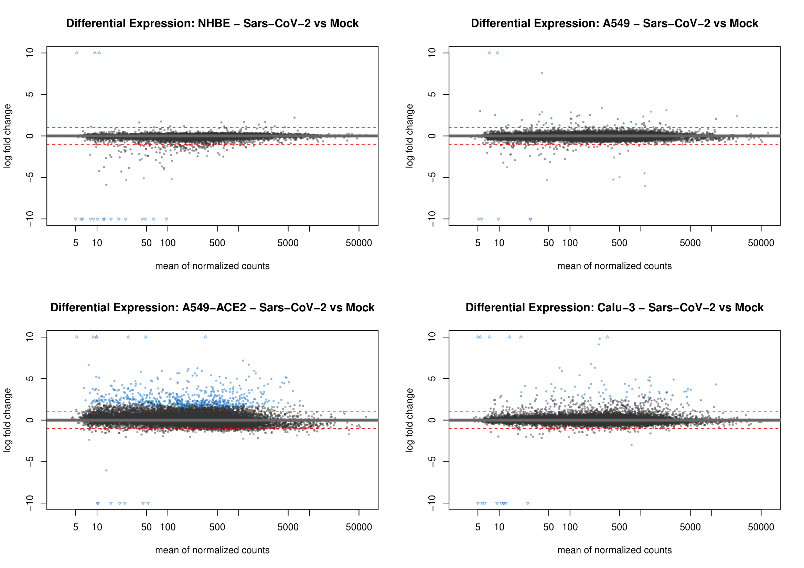

- **Directional Heatmaps —** The expression heatmaps of the top 10 upregulated and downregulated genes per cell line gave the clearest view of the directional contrast between models. In NHBE, the most physiologically relevant primary airway model, virtually all significant genes were suppressed, with the upregulated heatmap showing only sparse, low-amplitude switching relative to mock. In contrast, A549-ACE2 and Calu-3 displayed strong, coherent upregulation across infected replicates, with genes such as IFIT2, IFIT3, IFNB1, and TNF clustering tightly and separating clearly from controls. This pattern — transcriptional silencing in primary airway cells versus robust innate immune activation in ACE2-expressing models — reflects SARS-CoV-2's documented ability to suppress interferon signalling in the cells it most naturally infects.

#### Expression Heatmaps — NHBE vs A549-ACE2 vs Calu-3 Upregulated Genes
<table>
  <tr>
    <td>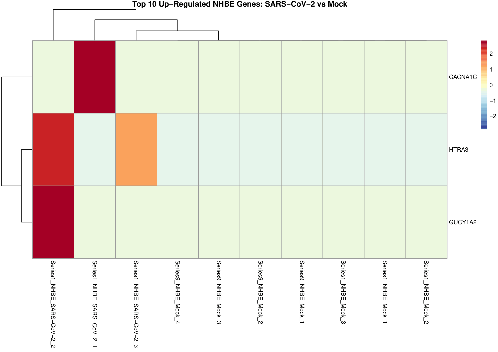</td>
    <td>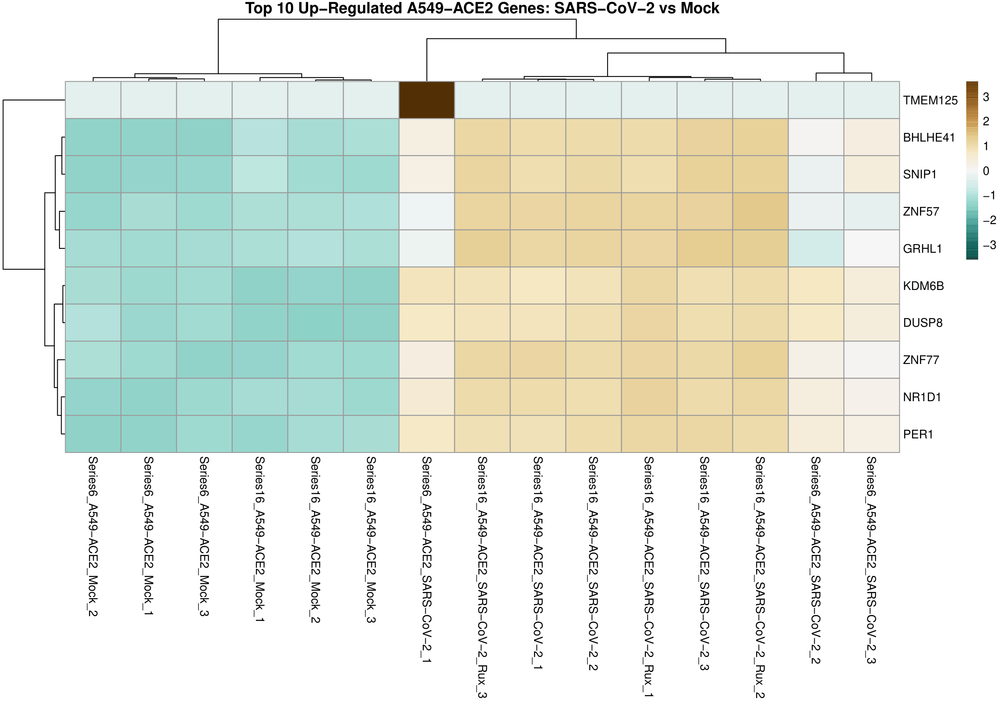</td>
    <td>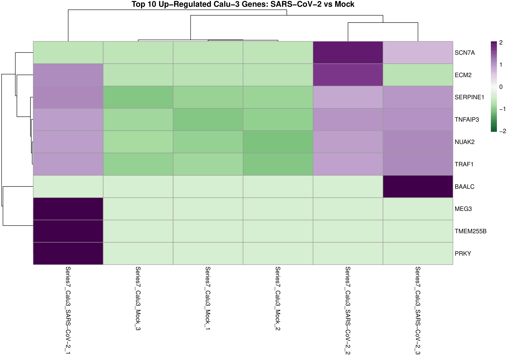</td>
  </tr>
</table>

- **Functional Enrichment Analysis —** Pathway enrichment analysis was feasible only for cell lines with sufficient DEG counts. NHBE and A549 upregulated gene sets were too small for robust enrichment — an outcome that is itself biologically meaningful, reflecting SARS-CoV-2's transcriptional suppression of primary airway cells. Enrichment results were obtained for A549-ACE2 and Calu-3 upregulated genes via GO and KEGG, and for A549 and A549-ACE2 downregulated gene sets via KEGG only.

  The most striking finding was a cross-cell-line convergence on antiviral and inflammatory signalling between A549-ACE2 and Calu-3. Despite being biologically distinct models, both independently activated the same core pathways upon infection:
  - The top GO Biological Process hit in both A549-ACE2 and Calu-3 was **response to virus** (GO:0009615), driven by canonical innate immune mediators including **IFNB1, IRF1, IFIT2, IFIT3, TNF, TNFAIP3, and USP18**. In A549-ACE2, 45 of 558 tested genes mapped to this term; in Calu-3, 18 of 65 — a higher enrichment fold reflecting Calu-3's more focused but equally robust antiviral programme.
  - **TNF signalling pathway** (hsa04668) was the top KEGG hit in both A549-ACE2 and Calu-3, followed by **IL-17 signalling** (hsa04657) and **NF-κB** signalling (hsa04064) in A549-ACE2, confirming broad NF-κB-mediated inflammatory activation as a central shared response across both ACE2-expressing models.
  - A549-ACE2 GO Molecular Function enrichment highlighted **DNA-binding transcription activator activity** (GO:0001228, 46/570 genes), pointing to widespread transcription factor rewiring driving the large-scale gene activation observed in this cell line.
  - Calu-3 GO MF enrichment was dominated by **cytokine activity** (GO:0005125), with key drivers including **IL6, IL12A, CSF2, CSF3, TNF, IFNB1, IFNL2, and IFNL3** — a cytokine profile consistent with the pro-inflammatory environment associated with severe COVID-19 pathology.
  - A549-ACE2 downregulated genes were enriched for **glutathione metabolism** (hsa00480, GSS, GCLM, GPX3), suggesting suppression of oxidative stress defence pathways in parallel with immune activation — a biologically plausible finding given the redox dysregulation documented in SARS-CoV-2 infection.
  - A549 downregulated KEGG enrichment returned the amphetamine addiction pathway (hsa05031), a recognised false-positive artefact of small-gene-set KEGG analysis through incidental overlap with dopamine-related genes. This result is not considered biologically relevant.

#### GO Biological Process Enrichment — A549-ACE2 & Calu-3 Upregulated

<table>
  <tr>
    <td>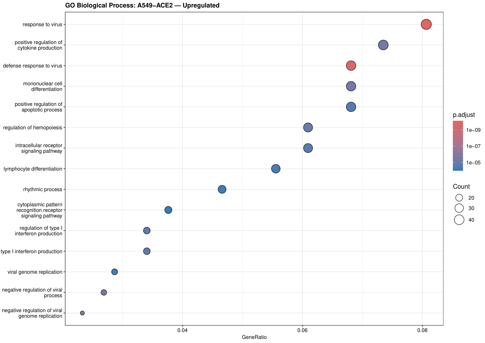</td>
    <td>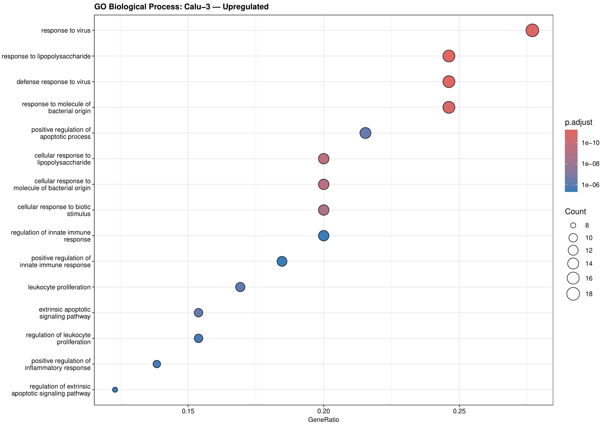</td>
  </tr>
</table>

#### GO BP Enrichment Maps — Term Relationship Networks

<table>
  <tr>
    <td>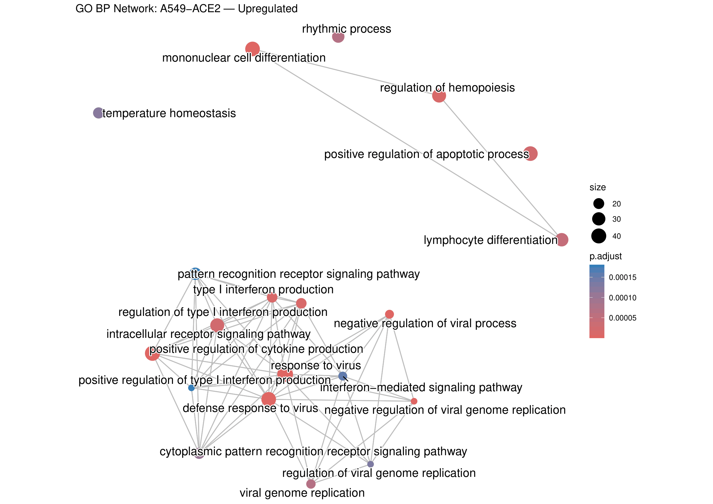</td>
    <td>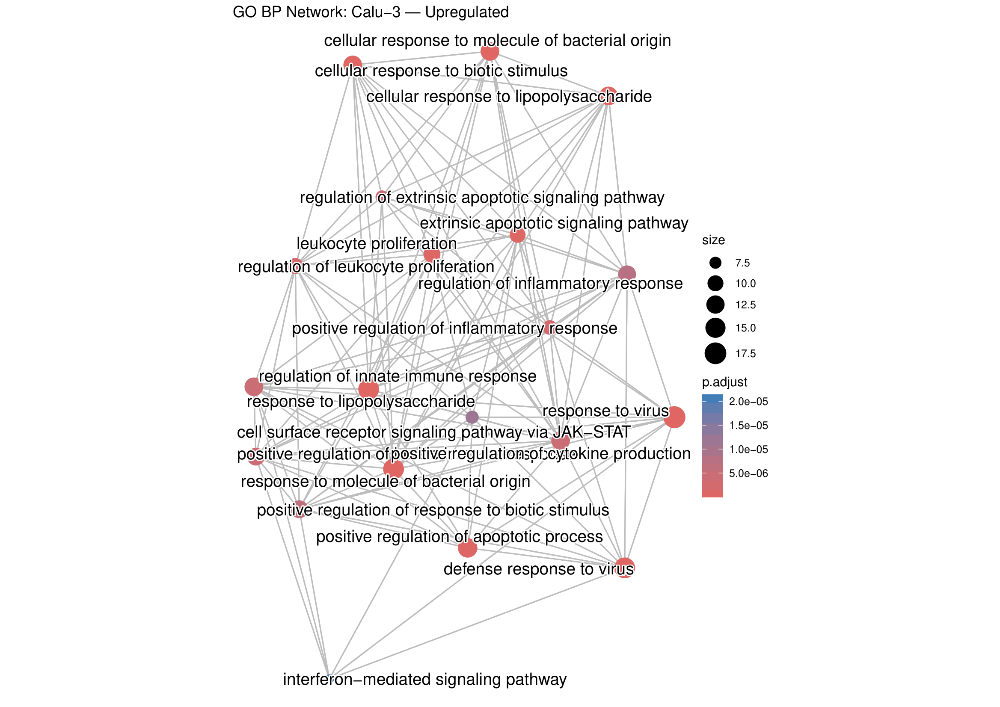</td>
  </tr>
</table>

#### GO Molecular Function Enrichment — A549-ACE2 & Calu-3 Upregulated

<table>
  <tr>
    <td>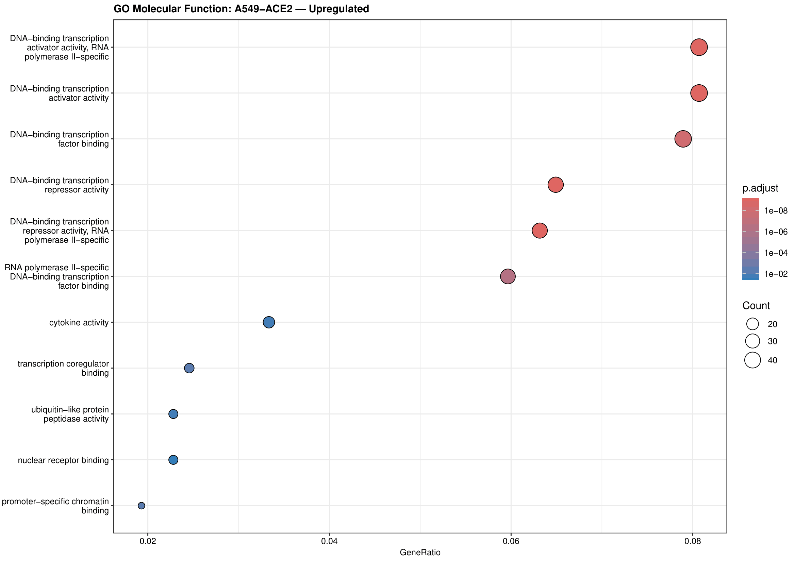</td>
    <td>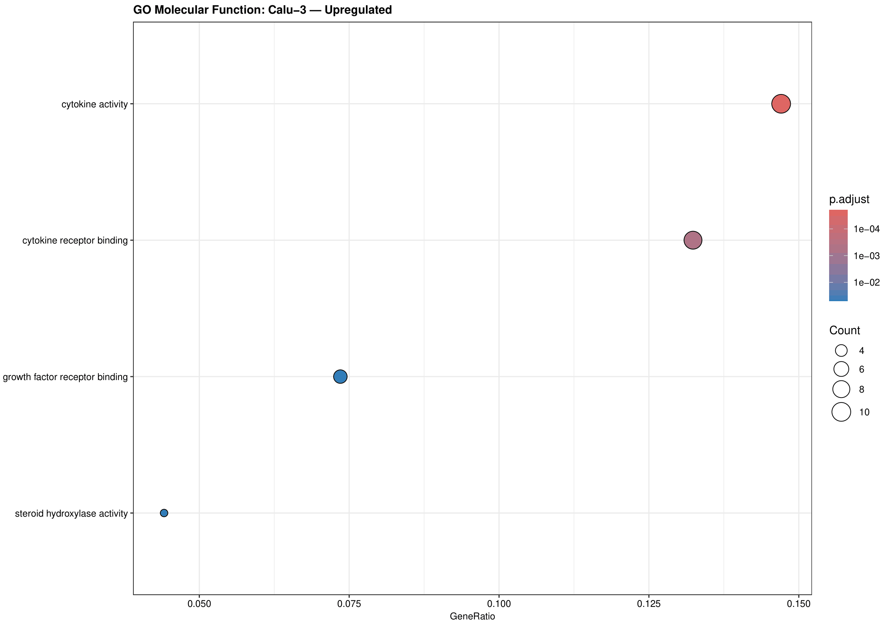</td>
  </tr>
</table>

#### KEGG Pathway Enrichment — A549-ACE2 & Calu-3 Upregulated

<table>
  <tr>
    <td>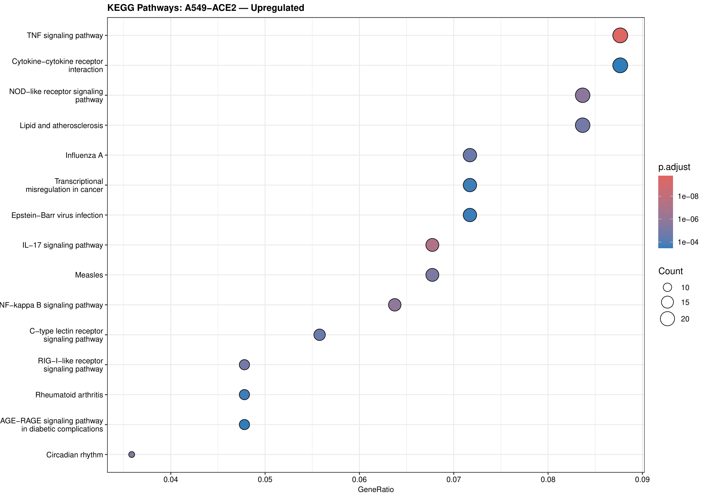</td>
    <td>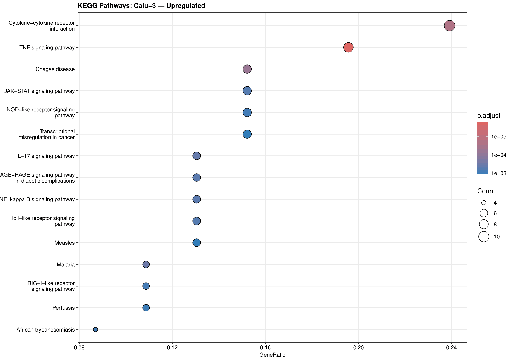</td>
  </tr>
</table>

#### Cross-Cell-Line GO BP Comparison (Upregulated Genes)

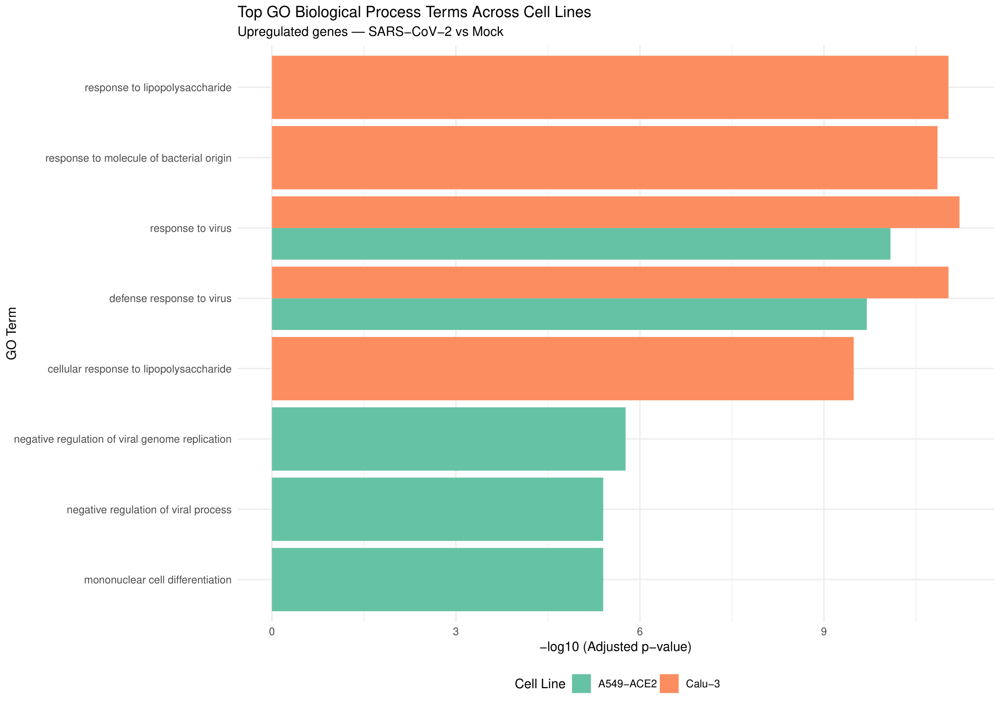

##### *Downregulated gene sets did not yield significant GO BP enrichment in any cell line due to small gene set sizes, and are therefore not included in this comparison.*

## Notes on Development
Building this pipeline independently required reconciling a non-trivial challenge at the design stage: GSE147507 includes not just four cell lines and two treatment conditions, but additional viral stimuli (IAV, RSV) that needed to be accounted for without confounding the SARS-CoV-2 comparisons. The solution was a single composite group factor encoding all sample combinations, from which specific contrasts were extracted — a design that keeps the dispersion model honest while allowing surgical pairwise testing. The most unexpected finding was not in the high-DEG models but in NHBE: the near-complete transcriptional silence in primary airway cells, and the subsequent absence of enrichable gene sets, forced a more careful biological interpretation than a straightforward pathway list would have. Learning to present a null enrichment result as biologically meaningful, rather than as a pipeline shortcoming, was the most analytically valuable outcome of this project.

---

## Repository Structure

```
SARS-CoV-2_RNA-Seq_Differential-Gene-Expression_Analysis/
├── GSE147507_DGE_Analysis/
│   ├── code/
│   │   └── DGE_Analysis.R
│   ├── datasets/
│   │   ├── GSE147507-GPL18573_series_matrix.txt
│   │   └── GSE147507_RawReadCounts_Human.tsv
│   ├── results/
│   │   ├── DGE_analysis/
│   │   │   ├── significant_DGE_across_A549-ACE2.csv
│   │   │   ├── significant_DGE_across_A549.csv
│   │   │   ├── significant_DGE_across_Calu-3.csv
│   │   │   └── significant_DGE_across_NHBE.csv
│   │   └── functional_enrichment_analysis/
│   │       ├── A549-ACE2_Upregulated_GO_BP.csv
│   │       ├── A549-ACE2_Upregulated_GO_MF.csv
│   │       ├── A549-ACE2_Upregulated_KEGG.csv
│   │       ├── A549-ACE2_Downregulated_KEGG.csv
│   │       ├── A549_Downregulated_KEGG.csv
│   │       ├── Calu-3_Upregulated_GO_BP.csv
│   │       ├── Calu-3_Upregulated_GO_MF.csv
│   │       └── Calu-3_Upregulated_KEGG.csv
│   └── visualizations/
│       ├── 01_Scatter_Plots.png
│       ├── 02_Histograms.png
│       ├── 03_Sample_Distance_Heatmap_NHBE.png
│       ├── 04_Sample_Distance_Heatmap_A549.png
│       ├── 05_Sample_Distance_Heatmap_A549_ACE2.png
│       ├── 06_Sample_Distance_Heatmap_Calu3.png
│       ├── 07_PCA_Plot.png
│       ├── 08_Dispersion_Plot.png
│       ├── 09_MA_Plots.png
│       ├── 10_Volcano_Plot_NHBE.png
│       ├── 11_Volcano_Plot_A549.png
│       ├── 12_Volcano_Plot_A549_ACE2.png
│       ├── 13_Volcano_Plot_Calu3.png
│       ├── 14_Top_10_Upregulated_Genes_Heatmap_NHBE.png
│       ├── 15_Top_10_Upregulated_Genes_Heatmap_A549.png
│       ├── 16_Top_10_Upregulated_Genes_Heatmap_A549_ACE2.png
│       ├── 17_Top_10_Upregulated_Genes_Heatmap_Calu3.png
│       ├── 18_Top_10_Downregulated_Genes_Heatmap_NHBE.png
│       ├── 19_Top_10_Downregulated_Genes_Heatmap_A549.png
│       ├── 20_Top_10_Downregulated_Genes_Heatmap_A549_ACE2.png
│       ├── 21_Top_10_Downregulated_Genes_Heatmap_Calu3.png
│       ├── 22_A549_ACE2_Upregulated_GO_BP_Dotplot.png
│       ├── 23_Calu3_Upregulated_GO_BP_Dotplot.png
│       ├── 24_A549_ACE2_Upregulated_GO_MF_Dotplot.png
│       ├── 25_Calu3_Upregulated_GO_MF_Dotplot.png
│       ├── 26_A549_Downregulated_KEGG_Dotplot.png
│       ├── 27_A549_ACE2_Upregulated_KEGG_Dotplot.png
│       ├── 28_A549_ACE2_Downregulated_KEGG_Dotplot.png
│       ├── 29_Calu3_Upregulated_KEGG_Dotplot.png
│       ├── 30_A549_ACE2_Upregulated_GO_BP_Enrichment_Map.png
│       ├── 31_Calu3_Upregulated_GO_BP_Enrichment_Map.png
│       └── 32_Top_GO_BP_Terms_comparison_across_cell_lines_for_Upregulated_Genes.png
├── LICENSE
└── README.md
```

---

## Data Acquisition

Both raw dataset files are included in the `GSE147507_DGE_Analysis/datasets/` folder.
The original data is publicly available from NCBI GEO under accession [GSE147507](https://www.ncbi.nlm.nih.gov/geo/query/acc.cgi?acc=GSE147507).

---

## Dependencies

All analyses were performed in **RStudio** using R 4.6.1 (2026-04-24 ucrt), Bioconductor version 3.23 (BiocManager 1.30.27). Install the required packages before running the script:

```
if (!require("BiocManager", quietly = TRUE))    install.packages("BiocManager")
if (!requireNamespace("Biobase",         quietly = TRUE)) BiocManager::install("Biobase")
if (!requireNamespace("GEOquery",        quietly = TRUE)) BiocManager::install("GEOquery")
if (!requireNamespace("DESeq2",          quietly = TRUE)) BiocManager::install("DESeq2")
if (!requireNamespace("ashr",            quietly = TRUE)) BiocManager::install("ashr")
if (!requireNamespace("pheatmap",        quietly = TRUE)) BiocManager::install("pheatmap")
if (!requireNamespace("ggrepel",         quietly = TRUE)) install.packages("ggrepel")
if (!requireNamespace("readr",           quietly = TRUE)) install.packages("readr")
if (!requireNamespace("here",            quietly = TRUE)) install.packages("here")
if (!requireNamespace("clusterProfiler", quietly = TRUE)) BiocManager::install("clusterProfiler")
if (!requireNamespace("org.Hs.eg.db",   quietly = TRUE)) BiocManager::install("org.Hs.eg.db")
if (!requireNamespace("enrichplot",      quietly = TRUE)) BiocManager::install("enrichplot")
if (!requireNamespace("DOSE",            quietly = TRUE)) BiocManager::install("DOSE")
```

---

## How to Reproduce

1. Clone this repository: https://github.com/ghoshparnabali/SARS-CoV-2_RNA-Seq_Differential-Gene-Expression_Analysis
2. Open `GSE147507_DGE_Analysis/code/DGE_Analysis.R` in RStudio.
3. Install all required packages (see Dependencies above).
4. Run the script section by section. DGE result CSV files will be saved to a `results/DGE_analysis/` folder and enrichment result CSV files to `results/functional_enrichment_analysis/` in the working directory. All visualisations will be rendered in RStudio's plot pane.

> **Note:** The KEGG enrichment analysis step requires an active internet connection. GO enrichment analysis runs fully offline via `org.Hs.eg.db`.

---

## License

This project is licensed under the MIT License — see the [LICENSE](https://github.com/ghoshparnabali/SARS-CoV-2_RNA-Seq_Differential-Gene-Expression_Analysis/blob/main/LICENSE) file for details.
